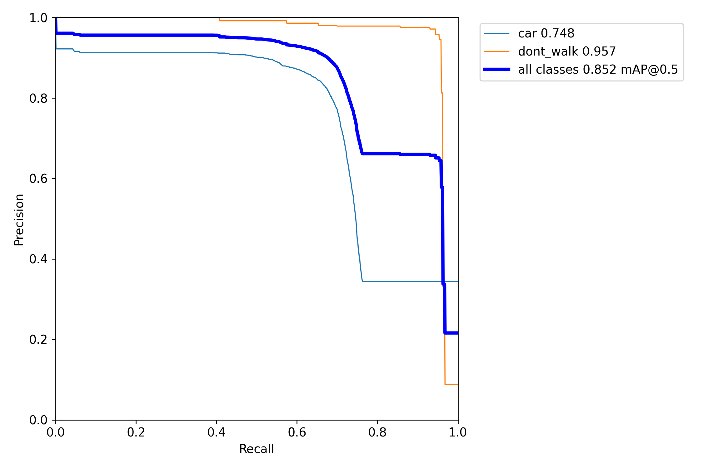
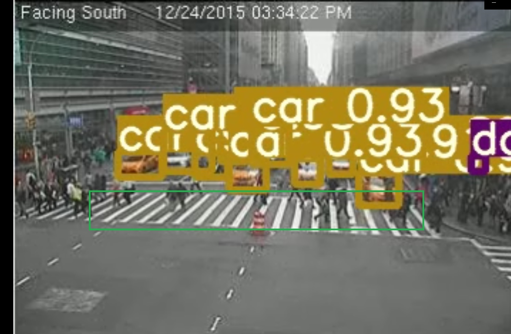

# Traffic Violation Detection
 Joseph Rosenblum


## Table of Contents

1. [Executive Summary](#1-executive-summary)
2. [Folder Structure](#2-folder-structure)
3. [Problem Statement](#3-problem-statement)
4. [Data Acquisition & Description](#4-data-acquisition-&-description)
5. [Software Requirements](#5-software-requirements)
6. [Data Cleaning, Processing, and EDA](#6-data-processing)
7. [Feature Engineering](#7-feature-engineering)
8. [Modeling](#8-modeling)
9. [Evaluation](#9-evaluation)
10. [Conclusion](#10-conclusion)
11. [Next Steps](#11-next-steps)

## 1 Executive Summary

Objective: The intent of this project was to create a method of detecting traffic violations from available camera data.  Data was chosen that matches format to what is currently available to The City of New York, while having lower resolution and quality.  This is to show that investments to hardware already made can be enhanced through software to provide this functionality.

Findings:  A method has been identified that can identify traffic violations.  Currently the project is limited to identifying vehicles that have stopped in the crosswalk at a red light, but there is a clear path forward to add more violations and to improve performance.

## 2 Folder Structure
```
tvd
|__ coco                            # original training set
|__ coco128                         # test sample of training set
|__ code
|   |__ wc2yolo.ipynb               # transforms annotations
|   |__ add_light_annotes.ipynb     # combines annotations
|   |__ crosswalk_check.ipynb       # checks for violations  
|
|__ data
|   |__ detection                   # source for violation detection
|   |__ img                         # general resources
|   |__ wcbatch (multiple)          # training directories
|   |__ wcbatch.yaml (multiple)     # training instructions
|
|__ presentation                    # shiny
|__ WebCamT                         # source dataset
|__ yolov5                          # object detection model
|__ README.md                       # this


```
- /coco contains [COCO dataset](cocodataset.org)    
- /coco128 contains a small sample of COCO
- /code contains all notebooks used in this project:
    - wc2yolo.ipynb: changes .XML into yolo annotations
    - add_light_annotes.ipynb: combines separate annotation files for vehicles and pedestrian signals
    - crosswalk_check.ipynb: uses object coordinates to detect crosswalk violations
- /data contains selections of data used for training and detection
- /presentation includes a powerpoint presentation
- /WebCamT includes the full [WebCamT dataset](https://www.citycam-cmu.com/) used for training
- /yolov5 contains the [YOLOv5 model](https://github.com/ultralytics/yolov5) used for object detection

## 3 Problem Statement
Municipalities today are cash-strapped, with [$360B in losses](https://www.nlc.org/article/2020/05/14/cities-anticipate-360-billion-revenue-shortfall/) expected between 2020 and 2022. [During times of shortfall, states have historically chosen to cut spending.](https://www.cfr.org/backgrounder/how-coronavirus-will-harm-state-and-city-budgets)  

More broadly, efforts to improve budgets to date have focused on cost reduction, primarily through reduction of labor hours through automation. Major technology infrastructure projects have accommodated this push, with [trillions in anticipated spending](https://www.cnbc.com/2016/10/25/spending-on-smart-cities-around-the-world-could-reach-41-trillion.html). And yet, the cost-savings from this technology have not been unlocked due to an insufficient parallel investment in software improvements. 

In our current system, traffic violations occur constantly and are frequently not enforced.  For most, there simply are no police present when they occur.  Even police presence does not guarantee enforcement.  Subjective decisions must be made: whether or not a violation committed justifies a car stop; whether a justifiable car stop is more important than whatever assignment they are currently on; whether they are prepared to follow up the issuance of a summons by going to court when required.

This leads to uneven enforcement.  The public may not always be aware of what factors are considered by police when they make a car stop or issue a summons, and that lack of insight is not a good thing.  For one thing, it can lead people to speculate that the worst motives which they themselves can imagine are the ones that actually drive policing decisions.

Even when a car stop is made and a summons is issued, car stops for traffic infractions are not, in general, an effective method of traffic enforcement.  The potential cost is too high.  No Police Officer, vehicle operator, or bystander should need to take on any additional risk over a minor traffic infraction that has already been committed.

While we don't want to be called out as individuals for doing anything improper behind the wheel, the overall impact of increased enforcement is a net gain for society.  Aside from being a more just society that takes itself and its laws serously, one major way traffic violation enforcement is useful for most of us is that vehicle operators operating more predictably, with fewer mistakes, reduce vehicle collisions and keep traffic flowing more smoothly, potentially providing us with both more speed and safety.

I propose leveraging advanced object recognition techniques into traffic inforcement cameras to broaden their capabilities. 

Currently, red-light camera systems and speeding systems exist and are broadly implemented.  These systems are [expensive to purchase, install, and maintain.](https://www.cdc.gov/motorvehiclesafety/calculator/factsheet/redlight.html#Costs)  These systems are each limited to only red-lights or speeding.  Each state and local government has thier own standards to follow for implementation of these devices.  In [New York State](https://www.nysenate.gov/legislation/laws/VAT/1111-A), for example, each city of one million residents or more may hold a vehicle owner liable for fines associated with violations detected by these camera systems, but are only allowed to install them at a maximum of 150 locations.  Which means we need to do more with less.

A machine-learning-based approach could be both less expensive and more effective.
To demonstrate low cost, this project will use data generated from inexpensive web-cams, typically costing no more than $100.  To demonstrate effectiveness, this project will focus on enforcement of vehicles stopped in a crosswalk, which is both dangerous for pedestrians and infrequently enforced.


## 4 Data Acquisition & Description
Most of the data used in this project was originally created as part of the project [Understanding Traffic Density from Large-Scale Web Camera Data](https://arxiv.org/abs/1703.05868).  This data consists of compressed, low-resolution webcam footage taken in various locations around New York City.  All images are formatted to 352 x 240.  Data in this set included custom .XML annotations for each vehicle.

I chose this set because it has very nearly the exact perspective and quality I was looking for.  The perspective nearly matches the cameras that the City of New York City uses to monitor intersections.  The quality, while not good, is very similar to what some of the more obsolete cameras that are currently in use would deliver.  This gives us a great place to work from, as these images are realistically very close to what would be obtainable at an affordable cost in the real world.

Additionally, YOLOv5 includes weights that have been pre-trained on the [COCO dataset](cocodataset.org), which contains 330K images.


## 5 Software Requirements

- [YOLOv5](https://github.com/ultralytics/yolov5), which requires a Python 3.8+ / PyTorch 1.7+ installation as well as everything listed in [requirements.txt](https://github.com/ultralytics/yolov5/blob/master/requirements.txt)
- [CVAT](https://cvat.org/) - used to create annotations
- [VirtualDub](virtualdub.org) - used for video processing

## 6 Data Processing
Specific parts of the total [WebCamT](https://github.com/Lotuslisa/WebCamT) dataset were suitable for this project, rather using the dataset in its entirety.  I chose to train on images that would most resemble the test data.

Since the project is focusing on crosswalk violations, I chose to use images taken at intersections with the vehicles facing the camera.  Not all intersections included crosswalks or pedestrian signals.  Since clear images of pedestrian signals were in shortest supply, they were the limiting factor of how much of the dataset would be useful.

There is a large imbalance between pedestrian signals and vehicles, because every image with a red pedestrian crossing signal could have twenty or more annotated vehicles within.  I don't believe this specific imbalance posed a major issue in the training, because this is not a classification problem, and the objects are so different from each other.

More concerning was a positive/ negative imbalance between images that include signals and those that do not.  I got best results at detecting if a signal was red when I also included images of the signals when they were not lit up red.  Vehicle recognition was not my limiting factor, so I did not add any more images of vehicles than I needed to.

I chose to train on 1025 images, which together contain almost 25000 vehicle annotations and only a few hundred pedestrian signal annotations.  These images were taken at the following two locations:

- Camera 398 - 3rd Avenue @ East 42nd Street
- Camera 181 - 8th Avenue @ West 42nd Street

Annotations of vehicles were included in the dataset.  They were created in XML, which I translated into yolo format.  During this process, useful images with missing and corrupted annotations were re-annotated.

## 7 Feature Engineering

Annotations were made for crosswalk and pedestrian crossing signals using [cvat](https://cvat.org/).  All annotations were combined into one single file per image.

## 8 Modeling
YOLOv5 was used for modeling for this project, as it was the best fit for the requirements.  The source data chosen is a difficult set to train a neural network on, and this application should provide both fast and accurate results.  Given that YOLOv5 provides what I was looking to achieve with this project, it made sense to use.

YOLOv5x is the largest model, providing the highest level of accuracy.  It is more than fast enough for our purposes, able to run inference on our data at around 50 fps on available hardware.

Advanced object detection models such as YOLOv5 contain hundreds of layers, and are broken down into sections serving different purposes.  The model is trained on bounding boxes to indicate the locations of objects, and returns bounding boxes when used to detect objects.

Mosaic augmentation and horizontal flipping augmentations were implimented in the training set.


## 9 Evaluation
This project uses the output from the model to feed a simple algorithm that will detect potential violations.  Because of this, the only objects that we will need the model to identify are vehicles and pedestrian crossing signals.  The best version of the model trained produced the precision / recall curve for these two classes as shown below:



The mean average precision of .852 shows that we are getting good results on our dataset, especially given how poor the image quality is:
Since the intent of the project is to issue a summons, precision is more important than recall.  We would rather not give someone deserving a summons a break than to give someone a summons who does not deserve one.  Keeping precision above .8, we are getting over .75 recall.

The accuracy metric looks worse than this performs in practice, because the vehicles of interest are those at the front of intersections, which are identified with much more confidence by the model than those in the back.  Those in the back are are smaller images occluded by other vehicles.

The project have some success at evaluating images to see if they fit the criteria established to determine if a vehicle is stopped in the crosswalk.  The image below illustrates how this is done:



After objects are detected, cars are tested to see if their bounding boxes extend below the 'top' of the crosswalk and if the pedestrian crossing signal is activated.  If so, it's checked to see how long these conditions for.  If they have existed, uninterrupted, for over the specified period of time, the frame is noted as possibly containing the violation we are looking for.

## 10 Conclusion
This goal of this project was to create a system that is capable of autonomously identifying traffic violations.  This system, in its current state, does come very close, in that it narrows down frames of interest.

This establishes that there is much more possibility from this method, but it does not quite reach our goal of finding these occurrences completely without human validation.

I will continue to work on this project and already have identified some next steps I am excited to work on.

## 11 Next Steps
- Combine everything as a single script

- Adding a linear equation to account for crosswalks not being straight lines
- Use intersection score to judge how deep into the crosswalk a vehicle is rather than a binary determination
- Adding a method to accomodate object tracking, rather than trying to determine action from a single image.  For example, while the Penske truck shown below was stopped in the crosswalk, it's clear there was another vehicle that should be held accountable for an improper turn, trapping the truck on the crosswalk.

- Detect the crosswalk or even street itself; use perspective to deepen understanding of what is happening
- to actually issue summones there needs to be a plate reader incorporated.  For this, you need much higher resolution images.  This could be:
    - another layer of object detection that occurs after vehicle of interest is identified.  Use a mask based on the bounding box of the vehicle to look for license plate / characters.
    - a vehicle sorted by its attributes can be attached to a license plate, once that has been established.  Possibly from another camera.  A pool of vehicles in an area can be tracked this way.
- experiment with adding a classification model